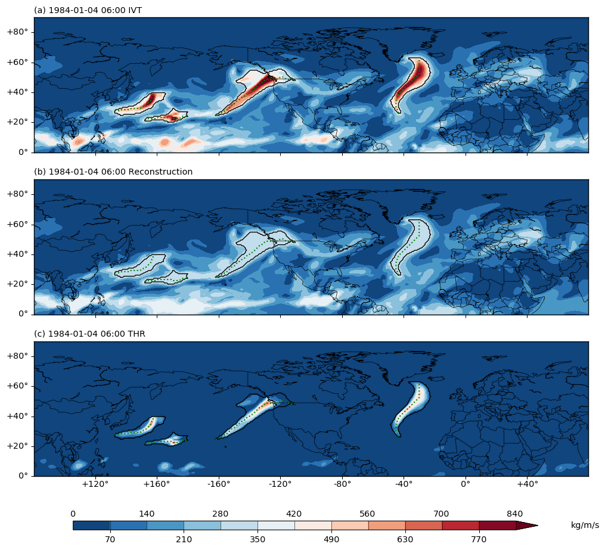

.. _detect_ars:

Detect AR appearances from THR output
=====================================

Definition of AR occurrence
###########################

An AR occurrence at a given time point is defined using these following rules:

1. A connected region in the IVT anomaly field (:math:`I - \delta(I)`,
   computed in the section ":ref:`compute_thr`") where its values is greater than 0.
2. The centroid (weighted by IVT values of the grid cells) of the region is north of :math:`20 ^{\circ} N` (or south of :math:`20 ^{\circ} S` for the Southern Hemisphere),
   and south of :math:`80 ^{\circ} N` (or north of :math:`80 ^{\circ} S` for the Southern Hemisphere), i.e. we are only interested in mid-latitude systems.
3. The region's area has to be within :math:`50 - 1800 \times 10^4 km^2`.
4. After the computation of this AR candidates axis (see :ref:`compute_axis`) and the effective width (defined as area/length ratio), the length has to be :math:`\ge\, 1500 km`, and length/width ratio has to be :math:`\ge \,2` if length is below :math:`2000\, km`.

.. note:: API is provided to control all these parameters.

.. _detect_params:

Input data
##########

These are the input data required for AR occurrence detection:

* u- and v- components of the integrated vapor fluxes (:math:`F_u` and :math:`F_v`).
* IVT (as :math:`\sqrt{F_u^2 + F_v^2}`), see :ref:`get_ivt` for more.
* The output from the THR process: the reconstruction component (:math:`\delta(I)`) and the anomaly
  component (:math:`I - \delta(I)`). See :ref:`compute_thr` for more.

Additional inputs:

* latitude, longitude and time axis. See :ref:`metadata` for more.
* detection parameters, see below.

::

        PARAM_DICT={
            # kg/(m*s), define AR candidates as regions >= than this anomalous ivt.
            'thres_low' : 1,

            # km^2, drop AR candidates smaller than this area.
            'min_area': 50*1e4,

            # km^2, drop AR candidates larger than this area.
            'max_area': 1800*1e4,

            # float, min length/width ratio, applied only when length<min_length.
            'min_LW': 2,

            # degree, exclude systems whose centroids are lower than this latitude.
            'min_lat': 20,

            # degree, exclude systems whose centroids are higher than this latitude.
            'max_lat': 80,

            # km, ARs shorter than this length is treated as relaxed.
            'min_length': 2000,

            # km, ARs shorter than this length is discarded.
            'min_length_hard': 1500,

            # degree lat/lon, error when simplifying axis using rdp algorithm.
            'rdp_thres': 2,

            # grids. Remove small holes in AR contour.
            'fill_radius': None,

            # do peak partition or not, used to separate systems that are merged
            # together with an outer contour.
            'single_dome': False,

            # max prominence/height ratio of a local peak. Only used when SINGLE_DOME=True
            'max_ph_ratio': 0.6,

            # minimal proportion of flux component in a direction to total flux to
            # allow edge building in that direction
            'edge_eps': 0.4
            }

.. _detect_python:

Usage in Python scripts
#######################

The following snippet shows the detection function calls:
::

        from ipart.AR_detector import findARs
        time_idx, labelsNV, anglesNV, crossfluxesNV, result_df = findARs(ivtNV.data,
            ivtrecNV.data, ivtanoNV.data, quNV.data, qvNV.data, latax, lonax,
            times=timeax, **PARAM_DICT)

where these input arguments are:

* ``ivtNV`` is a ``ipart.utils.NCVAR`` data object, which is a rudimentary wrapper
  object designed to achieve a tighter bound between data values and metadata.
  Same for the other variables with an ``NV`` suffix.
* ``ivtNV.data`` is the IVT data values in ``numpy.ndarray`` format, with
  dimensions of ``(time, level, latitude, longitude)`` or ``(time, latitude, longitude)``.
* ``ivtrecNV`` is :math:`\delta(I)`, and ``ivtanoNV`` is :math:`I-\delta(I)`, see :ref:`compute_thr` for more details.
* ``quNV``: is :math:`F_u`, and ``qvNV`` is :math:`F_v`.
* ``latax``: is an 1d array storing the latitude coordinates of ``ivtNV`` and others.
* ``lonax``: is an 1d array storing the longitude coordinates of ``ivtNV`` and others.
* ``timeax`` is a list of python ``datetime`` objects storing time stamps of the data in ``ivtNV`` and others.
* ``PARAM_DICT`` is the parameter dictionary as defined above.

The return values are:

* ``time_idx`` is a list of indices of the time dimension when any AR is found.
* ``labelsNV`` is a ``ipart.utils.NCVAR`` object, whose ``data`` attribute is an
  ndarray variable saving the numerical labels of all found ARs in each time step. It has shape of ``(time, lat, lon)``.
* ``anglesNV`` is a ``ipart.utils.NCVAR`` object storing an ndarray variable saving the difference in the orientation of IVT vectors in all found ARs, wrt the AR axis.
* ``crossfluxesNV`` is a ``ipart.utils.NCVAR`` object storing an ndarray variable saving the cross-sectional IVT flux, computed as the projection of IVT vectors onto the AR axis, using angles in angles.
* The ``result_df`` return value is a ``pandas.DataFrame`` object saving in a table the various attributes of all detected ARs at this time point.

.. seealso:: :py:func:`AR_detector.findARs`, :py:func:`AR_detector.findARsGen`, :py:func:`AR_detector.getARData`.

.. _ar_records:

AR records DataFrame
^^^^^^^^^^^^^^^^^^^^

The rows of ``ardf`` are different AR records, the columns of ``ardf`` are listed below:

* ``id``           : integer numeric id for this AR at this particular time point. ARs at different time points can share the same id, and an AR can be uniquely identified with the combination of time stamp + id.
* ``time``         : time stamp in the YYYY-MM-DD HH:mm:ss format.
* ``contour_y``    : list of floats, the y-coordinates (latitudes) of the AR contour in degrees North.
* ``contour_x``    : list of floats, the x-coordinates (longitude) of the AR contour in degrees North.
* ``centroid_y``   : float, latitude of the AR centroid, weighted by the IVT value.
* ``centroid_x``   : float, longitude of the AR centroid, weighted by the IVT value.
* ``axis_y``       : list of floats, latitudes of the AR axis.
* ``axis_x``       : list of floats, longitude of the AR axis.
* ``axis_rdp_y``   : list of floats, latitude of the simplified AR axis.
* ``axis_rdp_x``   : list of floats, longitude of the simplified AR axis.
* ``area``         : float, area of the AR in :math:`km^2`.
* ``length``       : float, length of the AR in :math:`km`.
* ``width``        : float, effective width in :math:`km`, as area/length.
* ``LW_ratio``     : float, length/width ratio.
* ``strength``     : float, spatially averaged IVT value within the AR region, in :math:`kg/(m \cdot s)`.
* ``strength_ano`` : float, spatially averaged anomalous IVT value within the AR region, in :math:`kg/(m \cdot s)`.
* ``strength_std`` : float, standard deviation of IVT within the AR region, in :math:`kg/(m \cdot s)`.
* ``max_strength`` : float, maximum IVT value within the AR region, in :math:`kg/(m \cdot s)`.
* ``mean_angle``   : float, spatially averaged angle between the IVT vector and the AR axis, in degrees.
* ``is_relaxed``   : True or False, whether the AR is flagged as "relaxed".
* ``qv_mean``      : float, spatially averaged meridional integrated vapor flux, in :math:`kg/(m \cdot s)`.

Detecated Python script
#######################

You can use the ``scripts/detect_ARs.py`` or
``scripts/detect_ARs_generator_version.py`` script (check them out in the
`github repo <https://github.com/ihesp/IPART>`_).
for AR detection process in
production.  The former does the computation and returns all outpus in one go,
and the latter yields results at each time step separately, so the outputs can
be saved to disk rather than accumulating in RAM.  Note that this process is
essentially time-independent, i.e. the computation of one time point does not
rely on another, therefore you can potentially parallelize this process to
achieve greater efficiency.

Example output
##############

The resultant detected ARs can be visualized using the following snippet:
::

    import matplotlib.pyplot as plt
    from ipart.utils import plot
    import cartopy.crs as ccrs

    plot_vars=[slab,slabrec,slabano]
    titles=['IVT', 'Reconstruction', 'THR']
    iso=plot.Isofill(plot_vars,12,1,1,min_level=0,max_level=800)

    figure=plt.figure(figsize=(12,10),dpi=100)

    for jj in range(len(plot_vars)):
        ax=figure.add_subplot(3,1,jj+1,projection=ccrs.PlateCarree())
        pobj=plot.plot2(plot_vars[jj],iso,ax,
                xarray=lonax, yarray=latax,
                title='%s %s' %(timett_str, titles[jj]),
                fix_aspect=False)

    plot.plotAR(ardf,ax,lonax)
    figure.show()

.. seealso:: :py:class:`utils.plot.Isofill`, :py:func:`utils.plot.plot2`.

One example output figure is shown below:

    (a) The IVT field in kg/(m*s) at 1984-01-04 06:00 UTC over the North
    Hemisphere. (b) the IVT reconstruction field at the same time point. (c)
    the IVT anomaly field from the THR process at the same time point. In all
    three subplots, the detected ARs are outlined in black contour. The AR axes
    are drawn in green dashed lines.

Notebook example
################

An example of this process is given in this `notebook <https://github.com/ihesp/IPART/blob/master/notebooks/3_detect_ARs.ipynb>`_.

