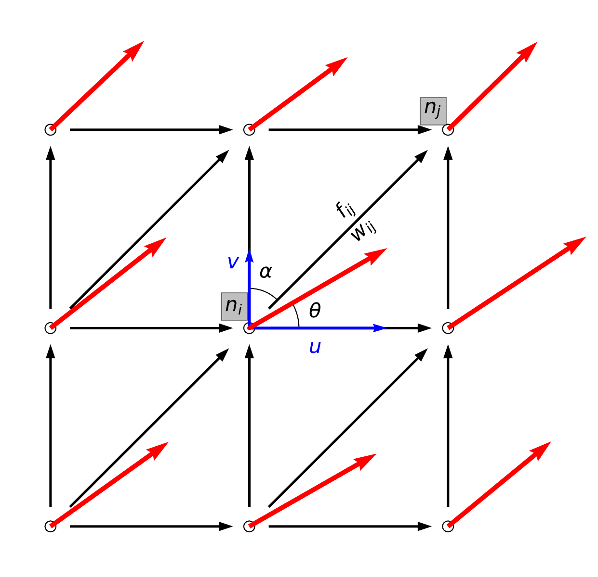

.. _compute_axis:

Find the axis from detected AR
==============================

Axis-finding in a planar graph framework
########################################

After :ref:`detect_ars`, a binary mask :math:`I_k` representing the spatial
region of each candidate AR is obtained.  An axis is sought from this region
that summarizes the shape and orientation of the AR. A solution in a planar
graph framework is proposed here.

A directed planar graph is build using the coordinate pairs :math:`(\lambda_k, \phi_k)` as nodes
(see Figure :numref:`fig1` below).
At each node, directed edges to its
eight neighbors are created, so long as the moisture flux
component along the direction of the edge exceeds a
user-defined fraction (:math:`\epsilon`, see the ``PARAM_DICT`` in :ref:`detect_params`) to the total flux.
The along-edge flux is
defined as:

.. math::

        \begin{equation}
                f_{ij} = u_i \sin (\alpha) + v_i\cos(\alpha)
        \end{equation}

where :math:`f_{ij}` is the flux along the edge :math:`e_{ij}` that points from node :math:`n_i`
to node :math:`n_j`, and :math:`\alpha` is the azimuth angle of :math:`e_{ij}`.

Therefore an edge can be created if :math:`f_{ij}/\sqrt{u_i^2+v_i^2} \geq \epsilon`.
It is advised to use a relatively small :math:`\epsilon=0.4` is used, as the orientation of an AR
can deviate considerably from its moisture fluxes, and denser edges in the
graph allows the axis to capture the full extent of the AR.

.. _fig1:

    Schematic diagram illustrating the planar graph build from the AR
    pixels and horizontal moisture fluxes. Nodes are taken from
    pixels within region :math:`I_k`, and are represented as circles. Red vectors
    denote :math:`IVT` vectors. The one at node :math:`n_i` forms an angle :math:`\theta`
    with the x-axis, and has components :math:`(u, v)`.  Black arrows denote
    directed edges between nodes, using an 8-connectivity neighborhood
    scheme. The edge between node :math:`n_i` and :math:`n_j` is :math:`e_{ij}`, and forms
    an azimuth
    angle :math:`\alpha` with the y-axis. :math:`w_{ij}` is the weight attribute
    assigned to edge :math:`e_{ij}`, and :math:`f_{ij}` is along-edge moisture
    flux.  

The boundary pixels of the AR region are then found, labeled :math:`L_{k}`. The
trans-boundary moisture fluxes are compute as the dot product of the gradients
of :math:`I_k` and :math:`(u_k, v_k)`: :math:`\nabla I_k \cdot (u_k, v_k)`.

Then the boundary
pixels with net input moisture fluxes can be defined as:

.. math::

        L_{k, in} = \{ p \in L_k \mid (\nabla I_k \cdot (u_k, v_k))(p) > 0 \}

Similarly, boundary pixels
with net output moisture fluxes is the set

.. math::

        L_{k, out} = \{ p \in L_k \mid (\nabla I_k \cdot (u_k, v_k))(p) < 0 \}

These boundary pixels are colored in green and black, respectively, in :numref:`fig2`.

.. _fig2:
.. figure:: fig2.png
    :width: 600px
    :align: center
    :figclass: align-center

    Application of the axis finding algorithm on the AR in the North Pacific,
    2007-Dec-1, 00 UTC. IVT within the AR is shown as colors, in
    :math:`kg/m/s`. The region of the AR (:math:`I_k`) is shown as a collection
    of gray dots, which constitute nodes of the directed graph. Edges among
    neighboring nodes are created.  A square marker is drawn at each boundary
    node, and is filled with green if the boundary node has net input moisture
    fluxes (:math:`n_i \in L_{k,in}`), and black if it has net output moisture
    fluxes (:math:`n_i \in L_{k,out}`). The found axis is highlighted in
    yellow.

For each pair of boundary nodes :math:`\{(n_i, n_j) \mid n_i \in L_{k, in},\, n_j \in
L_{k, out}\}`, a simple path (a path with no repeated nodes) is sought
that, among all possible paths that connect the entry node :math:`n_i` and the exit
node :math:`n_j`, is the **shortest** in the sense that its path-integral of weights is the lowest.

The weight for edge :math:`e_{ij}` is defined as:

.. math::
                w_{ij} = e^{-f_{ij}/A}

where :math:`f_{i,j}` is the projected moisture flux along edge :math:`e_{i,j}`
and :math:`A = 100\, kg/m/s` is a scaling factor.

This formulation
ensures a non-negative weight for each edge, and penalizes the inclusion of
weak edges when a weighted shortest path search is performed.

The `Dijkstra path-finding algorithm <https://networkx.github.io/documentation/stable/reference/algorithms/generated/networkx.algorithms.shortest_paths.weighted.single_source_dijkstra.html#networkx.algorithms.shortest_paths.weighted.single_source_dijkstra>`_  is used to find this shortest path
:math:`p^*_{ij}`.

Then among all :math:`p^*_{ij}` that connect all entry-exit pairs,
the one with the largest path-integral of along-edge fluxes is chosen as the AR
axis, as highlighted in yellow in :numref:`fig2`.

It could be seen that various aspects of the physical processes of ARs are
encoded.  The shortest path design gives a natural looking axis that is free
from discontinuities and redundant curvatures, and never shoots out of the AR
boundary.  The weight formulation assigns smaller weights to edges with larger
moisture fluxes, "urging: the shortest path to pass through nodes with
greater intensity. The found axis is by design directed, which in certain
applications can provide the necessary information to orient the AR with
respect to its ambiance, such as the horizontal temperature gradient,
which relates to the low level jet by the thermal wind relation.

Usage in Python scripts
#######################

The following snippet shows the axis finding process:
::

    from river_tracker1_funcs import maskToGraph, getARAxis

    #----------Convert mask to directed graph----------
    gii = maskToGraph(maskii, quslab, qvslab, costhetas, sinthetas, edge_eps)

    #--------------Get AR axis from graph--------------
    axisarrii, axismaskii = getARAxis(gii, quslab, qvslab, maskii)

where:

* ``maskii`` is the binary mask denoting the region of an found AR.
* ``quslab``, ``qvslab`` are the u- and v- component of integrated vapor fluxes at a given time point.
* ``sinthetas`` and ``costhetas`` are used to compute the azimuthal angles for each grid cell.
* ``edge_eps`` is the user defined parameter :math:`\epsilon`. This is defined in ``PARAM_DICT``, see :ref:`detect_params`.
* ``axisarrii`` is an array for the lat/lon coordinates of the found axis.
* ``axismaskii`` is a binary mask, with the same shape as ``maskii``, showing the found AR axis.

.. seealso:: :py:func:`river_tracker1_funcs.maskToGraph`, :py:func:`river_tracker1_funcs.getARAxis`.

Dedicated Python script
#######################

No detected Python script is offered for this process, as it is performed in the
:py:func:`river_tracker1.findARs()` function.

Notebook example
################

An example of this process is given in this `notebook <https://github.com/ihesp/AR_tracker/notebooks/3_detect_ARs.ipynb>`_.

