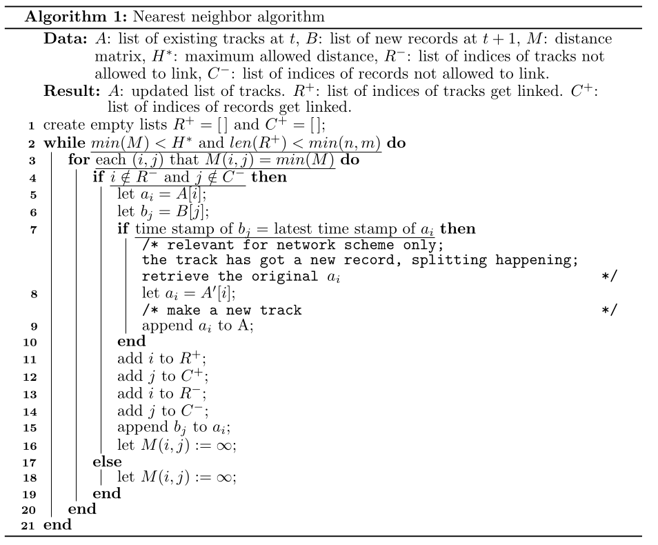

Track ARs at individual time steps to form tracks
=================================================

The modified Hausdorff distance definition
##########################################

After the :ref:`detect_ars` process, assume we have detected

* :math:`n` ARs at time :math:`t`, and
* :math:`m` ARs at time :math:`t+1`.

There are theoretically :math:`n \times m` possible associations to link these two groups of ARs. Of
cause not all of them are meaningful. The rules that are applied in the
association process are:

1. :ref:`nearest_neighbor`: for any AR at time :math:`t`, the nearest AR at time :math:`t+1` "wins" and is associated with it, subject to that:
2. the **inter-AR distance (H)** is :math:`\le 1200 \, km`.
3. no merging or splitting is allowed, any AR at time :math:`t` can only be linked to one AR at time :math:`t+1`, similarly, any AR at time :math:`t+1` can only be linked to one AR at time :math:`t`.
4. after all associations at any give time point have been created, any left-over AR at time :math:`t+1` forms a track on their own, and waits to be associated in the next iteration between :math:`t+1` and :math:`t+2`.
5. any track that does not get updated during the :math:`t-(t+1)` process terminates. This assumes that no gap in the track is allowed.

The remaining important question is how to define that **inter-AR distance (H)**. Here we adopt a modified **Hausdorff distance** definition:

.. math::
	H(A,B) \equiv min \{ h_f(A,B), h_b(A,B) \}

where :math:`H(A, B)` is the **modified Hausdorff distance** from track **A** to track **B**,
:math:`h_f(A,B)` is the **forward Hausdorff distance** from **A** to **B**, and :math:`h_b(A,B)` the **backward Hausdorff distance** from **A** to **B**. They are defined, respectively, as:

.. math::
	h_f(A, B) \equiv \operatorname*{max}_{a \in A} \{ \operatorname*{min}_{b \in B} \{
		d_g(a,b) \} \}

namely, the largest great circle distance of all distances from a point in **A** to the
closest point in **B**. And the backward Hausdorff distance is:

.. math::
	h_b(A, B) \equiv \operatorname*{max}_{b \in B} \{ \operatorname*{min}_{a \in A} \{
		d_g(a,b) \} \}

Note that in general :math:`h_f \neq h_b`. Unlike the standard definition of
Hausdorff distance that takes the maximum of :math:`h_f` and :math:`h_b`, we take the
minimum of the two.

The rationale behind this modification is that merging/splitting of ARs mostly
happen in an end-to-end manner, during which a sudden increase/decrease in the
length of the AR induce misalignment among the anchor points. Specifically,
merging (splitting) tends to induce large backward (forward) Hausdorff
distance.  Therefore :math:`min \{ h_f(A,B), h_b(A,B) \}` offers a more faithful
description of the spatial closeness of ARs. For merging/splitting events in a
side-to-side manner, this definition works just as well.

.. _nearest_neighbor:

The nearest neighbor link method
################################

To link AR records to form a track, a nearest neighbor method is used that the
two AR axes found in consecutive time steps with a Hausdorff distance :math:`\leq
1200 \, km` are linked, with an exclusive preference to the smallest Hausdorff
distance.

Formally, suppose :math:`n` tracks have been found at :math:`t=t\; :A = \{a_1,
a_2, \cdots, a_n\}`, and :math:`t=t+1` has :math:`m` new records: :math:`B = \{ b_1, b_2,
\cdots, b_m \}`. The Hausdorff distances between all pairs of possible
associations form a distance matrix:

.. math::
        M = \begin{bmatrix}
                H(a_1, b_1) & H(a_1, b_2) & \cdots & H(a_1, b_m) \\
                H(a_2, b_1) & H(a_2, b_2) & \cdots & H(a_2, b_m) \\
                \vdots      & \vdots      & \vdots & \vdots      \\
                H(a_n, b_1) & H(a_n, b_2) & \cdots & H(a_n, b_m) \\
        \end{bmatrix}

Then Algorithm shown in :numref:`figalg` is called with these arguments:

.. math::

        (A=A, B=B, M=M, H^*=1200\, km, R^-=[\,], C^-=[\,])

.. _figalg:

    Algorithm for the nearest neighbor link method.

The algorithm iteratively links two AR
records with the smallest distance, so long as the distance does not exceed a
given threshold :math:`H^*`.

It ensures that no existing track connects to more than
one new records, and no new record connects to more than one existing tracks.
After this, any left-over records in :math:`B` form a new track on their own. Then
the same procedure repeats with updated time :math:`t:=t+1`. Tracks that do not
get any new record can be removed from the stack list, which only maintains
a few active tracks at any given time.
Therefore the complexity does not scale with time.

.. note:: One can use 3 consecutive calls of the above algorithm, with different input arguments, to achieve merging and splitting in the tracks.

Input data
##########

This step takes as inputs the AR records detected at individual time steps as
computed in :ref:`detect_ars`.

The tracker parameters used:
::

        # Int, hours, gap allowed to link 2 records. Should be the time resolution of
        # the data.
        TIME_GAP_ALLOW=6

        # tracking scheme. 'simple': all tracks are simple paths.
        # 'full': use the network scheme, tracks are connected by their joint points.
        TRACK_SCHEME='simple'  # 'simple' | 'full'

        # int, max Hausdorff distance in km to define a neighborhood relationship
        MAX_DIST_ALLOW=1200  # km

        # int, min duration in hrs to keep a track.
        MIN_DURATION=24

        # int, min number of non-relaxed records in a track to keep a track.
        MIN_NONRELAX=1

        # whether to plot linkage schematic plots or not
        SCHEMATIC=True

Usage in Python scripts
#######################

The tracking process is handled by the :py:func:`AR_tracer.trackARs` function:
::

        from ipart.AR_tracer import trackARs
        from ipart.AR_tracer import readCSVRecord

        ardf=readCSVRecord(RECORD_FILE)
        track_list=trackARs(ardf, TIME_GAP_ALLOW, MAX_DIST_ALLOW,
            track_scheme=TRACK_SCHEME, isplot=SCHEMATIC, plot_dir=plot_dir)

where

* ``RECORD_FILE`` is the path to the ``csv`` file saving the individual AR records. Refer to `this notebook <https://github.com/ihesp/IPART/blob/master/notebooks/3_detect_ARs.ipynb>`_ for more information on the creation of this file.
* ``ardf`` is a ``pandas.DataFrame`` object containing the AR records at individual time points.
* ``track_list`` is a list of ``AR objects``, each stores a sequence of AR records that form a single track.  The ``data`` attribute of the ``AR object`` is a ``pandas.DataFrame`` object, with the same columns as shown in :ref:`ar_records`.

After this, one can optionally perform a filtering on the obtained tracks,
using :py:func:`AR_tracer.filterTracks`, to remove, for instance, tracks
that do not last for more than 24 hours:
::

        from ipart.AR_tracer import filterTracks
        track_list=filterTracks(track_list, MIN_DURATION, MIN_NONRELAX)

Example output
##############

The resultant AR track can be visualized using the following snippet:
::

        from ipart.utils import plot
        import cartopy.crs as ccrs

        latax=np.arange(0, 90)
        lonax=np.arange(80, 440)  # degree east, shifted by 80 to ensure monotonically increasing axis

        plot_ar=track_list[6]  # plot the 7th track in list

        figure=plt.figure(figsize=(12,6),dpi=100)
        ax=figure.add_subplot(111, projection=ccrs.PlateCarree())
        plotplotARTrack(plot_ar,latax,lonax,ax,full=True)

.. seealso:: :py:func:`utils.plot.plotARTrack`.

The output figure looks like :numref:`figtrack` below.

.. _figtrack:
.. figure:: ar_track_198424.png
    :width: 700px
    :align: center
    :figclass: align-center

    Locations of a track labelled "198424" found in year 1984. Black to yellow color scheme indicates
    the evolution.

Dedicated Python script
#######################

You can use the ``scripts/trace_ARs.py`` script for AR tracking process in production.

.. note:: Unlike the AR occurrence detection process, this tracking process is time-dependent and therefore can not be paralleized. Also, if you divide the detection process into batches, e.g. one for each year, you may want to combine the output csv records into one big data file, and perform the tracking on this combined data file. This would prevent a track lasting from the end of one year into the next from being broken into 2.

Notebook example
################

An example of this process is given in this `notebook <https://github.com/ihesp/IPART/blob/master/notebooks/4_track_ARs.ipynb>`_.

